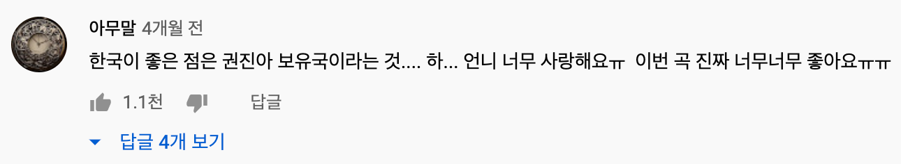

# 유투브 한글 댓글 익스텐션 명세

요약 : 유투브 비디오 아이디가 요청에 담기고, 한글 코멘트가 응답으로 오는 형태

## back

### 1. 요청

- url: /api/v1

- method: GET? POST? 뭘로할지 모르겠슴 알아서 정하셈

- params

  - v: 유투브 비디오 아이디

    https://www.youtube.com/watch?v=7HTSNdi334U 여기서 `v=` 뒷 부분

### 2. 응답

- 형태: json
- 구조
  - status: 
    - 200: 문제 없을 때
    - 500: 뭔가 문제 있을 때
    - 해보고 뭔가 더 다양하게 필요하면 업데이트 필요ㅎ
  - items:
    - 배열
    - https://developers.google.com/youtube/v3/docs/commentThreads?hl=ko#resource 여기 참고, 얘네들이 배열로 전달 되면 됨, 안에 내용 봐서 내용이 한글인지 아닌지 걸러서 보내줘야됨

## front

### 스토리 라인

1. 썸네일
   - 썸네일 클릭 시 해당 사람 페이지로 이동
2. 유저네임
   - 유저 네임 클릭 시 해당 사람 페이지로 이동
3. 타임라인
   -  humanize해서 출력
4. content
   - 내용 여러 줄일 경우 여러 줄로 표시
   - 자세히 보기 - 간략히 보기 표시 여부 결정하지 않음
5. 좋아요
   - 좋아요 수는 표시
   - 좋아요 버튼은 아직 동작하게 하지 않을 것
6. 싫어요
   - 포함하지 않음
7. 답글
   - 포함하지 않음
8. 답글 표시
   - 일단 개수만 표시할 지, 아예 표시하지 않을 지 결정하지 않음
   - 1차 배포 때는 답글 보기는 포함하지 않을 예정

### 데이터 api 정리

`item` 은 `items` 배열의 엘리먼트를, `comment` 는 `comments` 배열의 엘리먼트를 의미

- 썸네일
  - 이미지 url: `item.snippet.topLevelComment.snippet.authorProfileImageUrl`
  - 채널 url: `item.snippet.topLevelComment.snippet.authorChannelUrl`
- 유저네임
  - 유저네임: `item.snippet.topLevelComment.snippet.authorDisplayName`
  - 채널 url: `item.snippet.topLevelComment.snippet.authorChannelUrl`

- 작성시간
  - 작성시간: `item.snippet.topLevelComment.snippet.publishedAt`
  - 수정시간: `item.snippet.topLevelComment.snippet.updatedAt`
- content
  - 보이는 내용: `item.snippet.topLevelComment.snippet.textDisplay`
  - 원래 내용: `item.snippet.topLevelComment.snippet.textOriginal`
  - 아직 둘 차이 뭔지 알지 못함, 아마 여러 줄 표시와 관련 있을 듯
- 좋아요
  - 좋아요 수: `item.snippet.topLevelComment.snippet.likeCount`
- 답글
  - 답글 수: `item.snippet.topLevelComment.snippet.totalReplyCount`
  - 답글 내용: `item.replies.comment.snippet`

