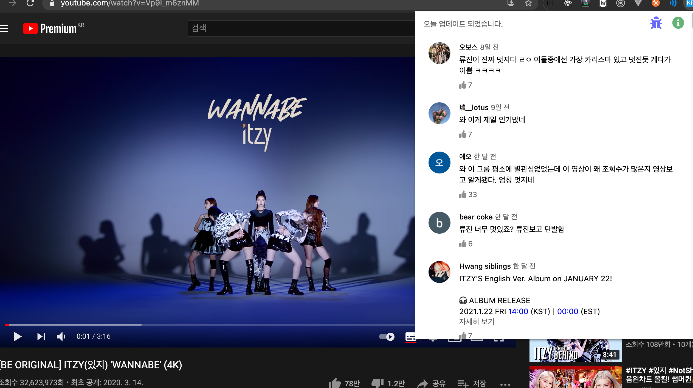
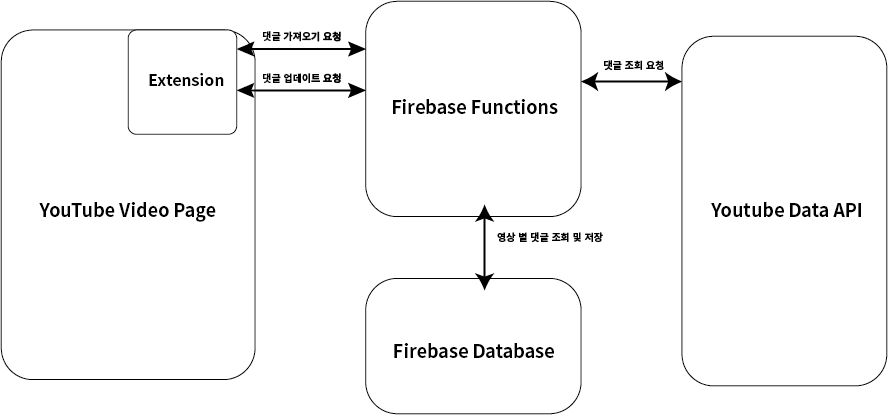

[toc]

# Korean Comments

한국어 댓글을 모아보기 위한 크롬 익스텐션 프로젝트

- :link: 웹 스토어 주소

  https://chrome.google.com/webstore/detail/korean-comments/eknankncobchjfgoddbonnpdlhdcjnod?hl=ko

- :open_file_folder: 백엔드 repo는 아래 주소에 있습니다. 개발일지:notebook_with_decorative_cover: 도 여기에 있어요!

  https://github.com/bingbing-ba/korean-comments-back

## 개발 배경

Youtube:play_or_pause_button: 에서 한국 영상인데 오히려 영어 댓글이 많아서 한글 댓글만 보고 싶어서 만든 익스텐션입니다.

## 기능

- Youtube 영상 페이지에서 크롬 익스텐션 버튼을 누르면 인기 댓글 순으로 댓글 100개를 가져와 익스텐션 팝업창으로 보여줍니다.
- 파랗게 표시된 시간을 누르면 새 창으로 해당 타임라인의 영상이 재생됩니다.
- `자세히 보기`/`간략히 보기` 를 지원합니다.
- 그 외 원래 유튜브 댓글에서 지원하는 기능(좋아요 등)을 거의 지원하지 않습니다. 겉 모습만 따라 만들었습니다.

## 구조

### Extension(front)

1. extension에서 서버에 해당 영상의 댓글 조회를 요청합니다.

2. 서버의 응답에 데이터가 없거나 너무 오래된 경우(3일 이상) update를 요청하고, 완료되면 다시 댓글 조회를 요청합니다.
3. popup에 댓글을 띄웁니다.

### Firebase Functions(back)

- 조회 요청이 오면 db에서 댓글 데이터를 찾아 응답합니다.
- update 요청
  - 한글 댓글이 100개가 되거나, 인기 댓글 1700개를 모두 확인할 때까지 youtube api에 요청을 보냅니다.(youtube api는 1회 요청 당 댓글 100개 확인 가능)
  - 업데이트가 완료되면 업데이트 시점과 함께 데이터를 db에 저장합니다.

### 해당 구조를 선택한 이유

#### 1. 따로 Youtube Data API를 이용해 댓글을 가져오기로 한 이유

기본적으로 youtube페이지는 무한 스크롤로 한번에 10개~20개 정도의 댓글을 요청하는 것으로 보입니다(1~2초 정도 소요). 제가 고려한 영상은 댓글 100개 당 한글 댓글이 1~2개 정도의 비율로 있었고, 해당 요청으로 원하는 만큼의 한글 댓글(100개 정도)를 가져오려면 너무 오랜 시간이 소요되었습니다.

Youtube Data API에서는 한 번에 100개의 댓글을 요청할 수 있어서 시간 소요를 훨씬 줄일 수 있게 되어 선택하였습니다.

#### 2. 따로 DB를 두고 3일의 업데이트 기한을 둔 이유

유튜브의 인기 댓글은 하루 이틀 정도는 크게 변화하지 않으므로 비싸고 시간이 많이 드는 API요청을 매번 하는 것은 비효율적이었습니다. db를 활용해서 3일에 한 번 정도만 해당 영상의 댓글을 업데이트 하도록 조치하였습니다.

## 이 프로젝트를 더 이상 진행하지 않는 이유

- 만들고 나서 직접 사용하다보니 제가 너무 엣지케이스를 고려해 앱을 제작했다는 것을 느끼게 되었습니다. 대부분 영상에서 영어와 한글 댓글 비중이 100:1 처럼 극단적이지 않습니다. 일반 영상에서 유투브 페이지에서 로딩을 활용해서 영어 댓글만을 걸러도 충분히 빠른 속도로 한글 댓글을 확인할 수 있었습니다.

- 해당 방식으로 다른 분이 만드신 익스텐션이 이미 잘 나가고 있습니다.

  https://chrome.google.com/webstore/detail/youtube-comment-language/pliobnchkbenbollnjaaojhbjkjgfkni

- 자세한 내용은 블로그에 작성하였습니다.

  https://bingbingba.tistory.com/7

